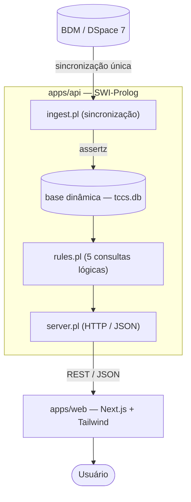

# Portal de TCCs — Cursos de Computação UFPA

Sistema web para consulta dos Trabalhos de Conclusão de Curso já defendidos nos
cursos de Ciência da Computação e Sistema de Informação da Universidade Federal
do Pará.


## Contexto

Trabalho desenvolvido como Avaliação 3 da disciplina. O enunciado define um
sistema web, com front-end e back-end, para consulta de TCCs por cinco
critérios, com a exigência de que as regras de consulta sejam implementadas em
linguagem lógica e de que a base de dados seja construída pela equipe.

O projeto atende a essas exigências da seguinte forma:

- A base de dados é constituída por fatos dinâmicos em Prolog, persistidos em
  arquivo.
- As cinco consultas são regras Prolog que operam sobre esses fatos.
- Os dados são obtidos da Biblioteca Digital de Monografias da UFPA (BDM,
  plataforma DSpace 7) em uma etapa de sincronização, e não a cada requisição.

## Escopo funcional

O sistema disponibiliza as seguintes consultas:

1. Por título.
2. Por autor.
3. Por orientador.
4. Por período (intervalo de anos).
5. Por palavra-chave.

Acrescentam-se a listagem completa do acervo, o filtro por curso (Ciência da
Computação ou Sistema de Informação) e o acesso ao arquivo PDF de cada trabalho.

## Arquitetura



Princípio que rege a implementação: nenhuma camada externa ao Prolog executa
filtragem, busca ou ordenação. A BDM é acessada apenas durante a sincronização;
toda consulta do usuário é resolvida pelas regras lógicas. O backend é escrito
exclusivamente em SWI-Prolog, o que impede que a lógica de consulta seja
deslocada para fora da linguagem lógica.

## Estrutura do repositório

```
apps/
  api/        Backend em SWI-Prolog (base de dados, regras, HTTP, sincronização)
  web/        Frontend em Next.js e Tailwind CSS
scripts/      sync.sh (sincronização) e serve.sh (execução do servidor)
```

## Requisitos

- SWI-Prolog 9 ou superior (`swipl` disponível no PATH).
- Node.js 18 ou superior.

## Execução

| Etapa | Comando | Resultado |
|---|---|---|
| 1 | `bash scripts/sync.sh` | Importa os TCCs da BDM e gera `apps/api/data/tccs.db`. |
| 2 | `bash scripts/serve.sh` | Inicia o backend em `http://localhost:8080`. |
| 3 | `cd apps/web && npm install && npm run dev` | Inicia o frontend em `http://localhost:3000`. |

A sincronização requer conexão com a internet e deve ser executada ao menos uma
vez antes de iniciar o servidor. As consultas subsequentes não acessam a BDM.

